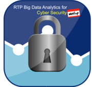

# RTP Big Data Analytics for Cyber Security

The Research Triangle Park (RTP) Big Data Analytics Cyber Security Meetup is a community-driven meetup for and by information security and also big data analytics community members. The goal is to expand the spectrum of conversation beyond just cyber security or just big data analytics.  Members both present and participate in an intimate atmosphere learning from each other.

With many tech-companies, colleges and universities in Raleigh, Durham, Chapel Hill and surrounding areas, it is also an international center of innovation in the security industry. Whether you are a security expert, researcher, data scientist, or a big data analytics guru you can participate, learn, and have fun at the RTP Big Data Analytics Cyber Security Meetup.

